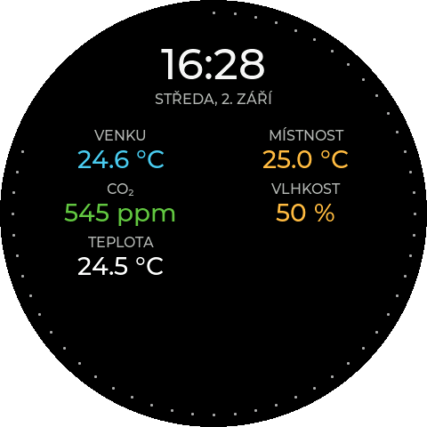

# Waveshare Hodiny

🇨🇿 **[Česká dokumentace](README.md)**

An open-source information dashboard for the round 480 × 480 px
[Waveshare ESP32-S3-Touch-LCD-2.1](https://www.waveshare.com/esp32-s3-touch-lcd-2.1.htm).
It displays time, date, weather, temperatures, additional sensor values and
precipitation radar data from the Czech Hydrometeorological Institute (CHMI).
Values can come from Open-Meteo without an account, optionally extended with
personal TMEP.cz sensors, or from Home Assistant. Appearance, data sources,
location, radar, brightness, animations and updates are configured in a web
interface without editing source code.

<p align="center">
  <a href="https://coolajz.github.io/waveshare-hodiny/">
    
  </a>
</p>

<p align="center">
  <strong>Simple USB installation without downloading files.</strong><br>
  Open the installer in desktop Chrome or Edge, connect the display and follow the guided steps.
</p>

---

<p align="center">
  
  
</p>

<p align="center">
  
  
  
</p>

<p align="center">
  
</p>

The project is Czech and the firmware defaults to Czech. English can be selected
in the device web configuration; the setting is stored persistently and also
changes the system text and verbal date shown on the display.

## Features

- digital clock with Barlow, Liberation Sans, LCD DSEG and Doto fonts, an
  analog dial with a configurable tone and optional cardinal accents, or the
  VALUES face with a grid of up to eight values,
- multiple date formats and an optional seconds ring,
- NTP time synchronization and the Czech time zone with daylight saving time,
- Open-Meteo support without an account or token,
- Home Assistant entities read through its REST API,
- two generic top values with individual names, units, precision, icons and
  smooth color scales,
- static and animated weather icons based on Meteocons,
- CHMI precipitation radar with a Czech map, cities and 1–15 frames,
- 25, 50, 100 and 200 km radar ranges plus a full-country view,
- optional automatic rotation between the clock and radar,
- two additional values such as CO₂, VOC, particulate matter, humidity,
  pressure or battery level,
- eight independent values on the VALUES face, each with its own name, Home
  Assistant entity, unit, precision and color scale,
- personal TMEP.cz sensors as an optional extension to Open-Meteo values,
- custom units, decimal precision and smooth color scales,
- independent day and night brightness with manual or automatic switching,
- dots, line and comet seconds effects,
- password-protectable web configuration, backup import/export and diagnostics,
- initial Wi-Fi provisioning through Improv Serial on either USB-C connector,
- A/B OTA updates that preserve Wi-Fi and device configuration,
- a Home Assistant control API protected by a random secret,
- basic settings directly on the touchscreen.

## Required hardware

The firmware is designed exclusively for **Waveshare ESP32-S3-Touch-LCD-2.1**
with a 480 × 480 px display and 16 MiB flash. Its ST7701 display, CST820 touch
controller, PSRAM, pin configuration and partition table match this exact board.

Do not flash the binary to another product merely because it also contains an
ESP32-S3. A different pinout or flash layout may prevent the device from booting.

## Installation

### Browser installation

The public [GitHub Pages installer](https://coolajz.github.io/waveshare-hodiny/)
can flash a stable release from desktop Chrome or Edge over USB. The installer
supports Czech and English. On first visit it uses Czech for browser languages
`cs` and `sk`; every other browser language uses English. The flag buttons in
the header switch the language manually.

Factory installation uses all four binary parts and the exact offsets declared
by the release `manifest.json`. The standalone `.ota.bin` file is an application
OTA image and must not be used as a factory image.

### Wi-Fi provisioning

Public releases contain no preconfigured Wi-Fi credentials. After flashing,
connect either USB-C port and configure the network through Improv Serial in the
installer. The SSID and password are stored in NVS and survive a restart.

The board exposes one USB–UART connector through CH343P and one native ESP32-S3
USB connector. Production firmware handles Improv Serial on both transports.

## First start

1. Install the firmware and provision Wi-Fi through Improv Serial.
2. Wait for the device to connect; its IP address appears in the settings screen.
3. Open `http://waveshare-hodiny.local/`. Use the displayed IP address if mDNS
   is unavailable on your network.
4. Select Open-Meteo with TMEP.cz or Home Assistant and search for the device
   location.
5. For Home Assistant, enter its URL and a long-lived access token, then test
   the connection.
6. Configure the dashboard, radar and brightness and save the changes.

A clean configuration uses Open-Meteo, Brno as the location and the full Czech
Republic radar view. Home Assistant is optional.

## Data sources

### Open-Meteo

Open-Meteo is the default source and requires no account or token. It supplies
the current weather and four configurable values. The selected city coordinates
also define the center of local CHMI radar views. Each of the four slots can
independently display 0–2 decimal places; the same setting also applies when a
TMEP.cz value is selected.

### TMEP.cz as an Open-Meteo extension

Your own TMEP.cz sensors can be added to Open-Meteo mode. Paste the complete URL
from **Extended JSON – with all sensors**, select **Verify and load sensors**, and
values from up to 32 sensors are appended to the same four selectors under a
TMEP.cz group. The firmware uses the unit returned by the export, including for
custom quantities.

When at least one TMEP value is selected, the complete export is fetched with
one HTTPS request every minute. With no selected TMEP value, the catalog is
loaded once after boot and is not refreshed periodically. Opening the web
configuration displays the cached catalog first and refreshes it from TMEP.cz
at most once per page load. Open-Meteo continues to refresh independently every
10 minutes.

The firmware extracts the ID and export key and always builds the request with
`extended=1&all=1`. These credentials remain stored on the device and are never
returned by the configuration API or backup. **Remove TMEP.cz** clears the URL,
catalog, diagnostics and TMEP assignments; affected slots return to their
default Open-Meteo values.

Example export URL:
`https://tmep.cz/vystup-json.php?id=11746&export_key=XXXXXXXXsd&extended=1&all=1`

### Home Assistant

The firmware reads individual entities through the Home Assistant REST API. It
does not require MQTT, a custom integration or an administrator account.

Create a dedicated long-lived access token in the Home Assistant user profile
and use an account with only the permissions the clock requires. After saving,
the token is never returned to the browser and can only be replaced.

The current firmware permits local HTTP and HTTPS Home Assistant servers with a
self-signed or otherwise invalid certificate. Certificate validation is therefore
disabled for this Home Assistant connection only. Use it on a trusted LAN and be
aware that this does not protect the token from an active network attacker.

Suggested entities:

| Value | Example entity | Notes |
| --- | --- | --- |
| Weather | `weather.home` | Text state or supported numeric code |
| Sun | `sun.sun` | Controls automatic day/night mode |
| Left value | `sensor.outdoor_temperature` | Temperature, CO₂, PM, pressure or any numeric sensor |
| Right value | `sensor.living_room_co2` | Temperature, CO₂, PM, pressure or any numeric sensor |
| Value A/B | `sensor.living_room_co2` | CO₂, VOC, PM, humidity, pressure, etc. |

Unavailable or invalid values are displayed as `--`.

## Web configuration

<p align="center">
  
</p>

The web interface configures:

- the device language; until a choice is stored, the display remains in Czech
  and the first web visit stores Czech for `cs`/`sk` browsers or English for
  every other browser language; later visits use the stored device setting and
  the fixed web header provides flag buttons for changing it at any time,
- the data source and shared geographic location,
- Home Assistant URL, token, weather and sun entities,
- left and right top values with type, name, unit, precision, icon and color
  scale,
- `Monochrome`, `Flat` and `Line` animated weather icon styles,
- CHMI radar range, map opacity, frame count, pause and automatic rotation,
- custom values, units, precision and color scales,
- the eight values of the VALUES face, each separately enabled, with its own
  entity, name, unit, precision and color scale; the section only appears with
  the Home Assistant data source, because the slots read entities,
- clock and date colors, fonts, date format and seconds effects,
- day/night brightness and automatic switching,
- automatic OTA updates and web-server availability,
- an optional web password,
- backup import/export, restart, display controls and live diagnostics.

### CHMI precipitation radar

Radar imagery comes from the open MAX_Z composite published by the Czech
Hydrometeorological Institute. Views cover 25, 50, 100 or 200 km around the
saved coordinates, or the whole Czech Republic. The map includes the national
outline and a range-specific selection of cities.

The radar is available only when Open-Meteo location search identifies the
saved country as `CZ`. For locations outside Czechia, the firmware does not
start the radar, download its data in the background or respond to radar
gestures, and automatic screen rotation is disabled. Open-Meteo weather and
Home Assistant remain available without this restriction.

One frame creates a static view; 2–15 frames create an animation from oldest to
newest. The pause after the newest frame is configurable from 0 to 30 seconds
and defaults to 5 seconds. In day mode the newest timestamp is bright green. A
thin bar below the caption shows animation progress and turns red while an
empty cache is being fully prepared. New imagery is checked in fixed
five-minute slots, approximately one minute after the CHMI publication time.

The red night appearance converts the map, cities, location marker, labels and
precipitation intensity levels to shades of red. The newest timestamp then uses
the same red as the other text. Changing the appearance reuses the prepared
cache and does not download or rebuild the animation.

The web range buttons preview a view immediately. Blue marks the range currently
shown on the clock and amber marks the saved default. The preview becomes
persistent only after saving the configuration. A range selected on the device
is temporary and the saved web value is restored after a restart.

Automatic rotation is disabled by default and provides separate clock and radar
durations. The radar duration is a minimum: an animation already in progress,
including its final pause, always completes before the clock returns. After a
restart, background cache preparation begins only after Wi-Fi is connected and
time synchronization has completed. The first automatic transition waits for
the complete animation, so playback starts immediately from the oldest frame.
With automatic rotation disabled, radar data is not downloaded in the
background and loading starts when the radar is opened manually.

### Color scales

Each additional value supports up to ten `value → color` points. The firmware
interpolates between neighboring points, producing a smooth scale rather than
hard color thresholds. The two values use independent scales.

### Day/night mode and seconds

Day and night brightness are independent. Automatic mode uses Open-Meteo sunrise
and sunset for the selected location or a Home Assistant sun entity. Optional
offsets adjust both transitions. With automation disabled, a short tap on either
the clock or radar switches the day and night appearance.

The configuration web server defaults to **Always on**. It can instead remain
available for ten minutes after startup or activation from the device, or be
disabled completely. Use it only on a trusted network; the dashboard gear icon
indicates an active configuration server. An optional 6–20 character password
protects web settings. The **System** tab shows an unprotected state in red and
an active password in green. Only a derived hash is stored, and the password is
not included in backups.

### Diagnostics and backups

The read-only `/diagnostics` page reports firmware, CPU, flash, current display
pixel clock, current and minimum internal RAM and PSRAM, the smallest free
stack space seen in the loop and data tasks, Wi-Fi, Home Assistant,
Open-Meteo and TMEP.cz runtime state. Radar details include the selected city, GPS,
range, prepared-frame count and time span, last successful refresh, next check,
HTTP status and the file currently being processed. Exported JSON backups
contain appearance and entity IDs but intentionally omit the Home Assistant
token, TMEP.cz export URL, web password and control API secret.

## Touchscreen settings

Long-press anywhere on the clock or radar to open the settings pages. A
horizontal swipe in either direction switches between the clock and radar.
On the radar, swiping up zooms in and swiping down zooms out; this range change
remains temporary until restart. With automatic day/night mode disabled, a
short tap on either screen switches the appearance. Arrow buttons move between
the three settings pages; swipes are not used inside the settings menu.
Available controls include day/night brightness, automatic mode, weather icons,
seconds effects, web-server mode and OTA checks.

## Animated Meteocons

Static monochrome icons are compiled into the firmware. Public animated icons
are downloaded from GitHub Pages and cached locally. Night mode always uses the
monochrome animation style so the icons follow the red night palette.

Only assets referenced by the firmware allowlist are published. See
[`METEOCONS_ASSET_PIPELINE.md`](METEOCONS_ASSET_PIPELINE.md) for the reproducible
asset-generation process and third-party attribution.

## OTA updates

Release firmware uses two equal 6 MiB application slots. Public builds read OTA
metadata and the application image only from the trusted GitHub Pages origin.
Before activating an image, the updater verifies HTTPS, HTTP status, declared
and received size, SHA-256, ESP32-S3 chip family and inactive-partition capacity.

If validation or writing fails, the running firmware remains active. Wi-Fi and
configuration in NVS and `clockcfg` survive a normal OTA update. A factory flash
or full erase is a separate operation and may remove user data.

Version 1.6.0 contains one historical configuration migration from public
version 1.5.5. It preserves the existing data source, Home Assistant settings,
entities and appearance, adds the radar options with the full-country view and
six frames, and leaves automatic rotation disabled. Intermediate development
schemas are not maintained as separate migration steps.

Automatic updates are disabled after a clean installation. When enabled, the
firmware checks at most once per local calendar day after 04:10. Manual and
automatic updates use the same implementation and validation.

## Home Assistant control API

The web interface shows a control endpoint containing a random 128-bit secret.
It can refresh data, control the backlight and invoke other supported actions.
Treat the URL as a credential and never publish it in screenshots, logs or Git.

## Building from source

### Dependencies

The verified toolchain uses Arduino CLI, Arduino ESP32 core `3.0.7`, LVGL
`8.3.10`, PNGdec `1.0.1` and Python 3. Do not substitute board options or flash
parameters from another ESP32-S3 board.

```bash
arduino-cli core install esp32:esp32@3.0.7 --config-file arduino-cli.yaml
arduino-cli lib install lvgl@8.3.10 --config-file arduino-cli.yaml
arduino-cli lib install PNGdec@1.0.1 --config-file arduino-cli.yaml
```

### Development build

```bash
./build.sh
./upload.sh
```

`./build.sh` uses the default home credentials from `WIFI_SSID` and
`WIFI_PASSWORD`. Run `./build.sh work` to use the separate
`WIFI_WORK_SSID` and `WIFI_WORK_PASSWORD` values.

Pass a serial port explicitly when needed:

```bash
./upload.sh /dev/cu.usbmodemXXXXXXXX
```

The development build retains USB diagnostics, screenshot commands and local
development defaults. It does not install a public OTA release automatically.

### Optional local `.env`

The entire `.env` file is ignored by Git. It can supply local Wi-Fi, Home
Assistant and Firmware Hub variables used by the existing generators. Never
commit real credentials. Generated headers belong only in the ignored
`WaveshareHodiny/local/` directory.

```dotenv
WIFI_SSID=
WIFI_PASSWORD=
WIFI_WORK_SSID=
WIFI_WORK_PASSWORD=
```

### Release build

Choose a valid SemVer version and build in the separate release workflow:

```bash
./build-release.sh 1.0.0
```

A release build must contain no Wi-Fi credentials and must keep Improv Serial
available on both USB-C connectors. Publishing a release is a separate,
explicitly authorized operation.

## USB screenshots

The development firmware supports framebuffer capture over its USB diagnostic
protocol. Use the repository script with the currently verified serial port:

```bash
./capture-screenshot.sh /dev/cu.usbmodemXXXXXXXX
```

## Repository layout

- `WaveshareHodiny/` – firmware source and embedded web interface,
- `docs/` – public installer and OTA/weather assets for GitHub Pages,
- `screenshots/` and `media/` – documentation media,
- `tools/` – generators and release validation tools,
- `build.sh` – development build,
- `build-release.sh` – isolated release build and package validation.

## Troubleshooting

- If `waveshare-hodiny.local` does not open, use the IP address shown on the
  device and check whether the web server is enabled.
- If the Home Assistant test fails, verify the URL, token, network reachability
  and entity IDs.
- A persistent `--` means the value is missing, unavailable or not numeric.
- OTA installation is available only in a compatible release build and only
  after a newer compatible version has been found.
- If USB is not detected, try a data-capable cable, the other USB-C connector
  and a direct computer port without a hub.

## Security and privacy

- Public releases contain no Wi-Fi credentials.
- Home Assistant tokens are stored locally and are not returned by the API.
- Backups omit tokens, passwords and the control API secret.
- OTA uses HTTPS and verifies the application image before activation.
- The configuration web server is intended for a trusted local network.
- Do not publish control URLs, credentials, `.env` files or generated secret
  headers.

## Acknowledgements

- [Waveshare](https://www.waveshare.com/) for the hardware and documentation,
- [LVGL](https://lvgl.io/) for the embedded graphics library,
- [Meteocons](https://meteocons.com/) for weather icon artwork,
- [Open-Meteo](https://open-meteo.com/) for weather data,
- [CHMI](https://www.chmi.cz/) for open precipitation radar data,
- [Home Assistant](https://www.home-assistant.io/) for the automation platform.

I used and adapted parts of Petr's open-source
[MeteoPlaneRadar](https://github.com/petus/MeteoPlaneRadar) project from
[Chiptron.cz](https://chiptron.cz/) while implementing the radar. Thank you for
publishing the project, the practical CHMI radar-data example and the map data
that made this integration possible.

## License

The project is licensed under the [MIT License](LICENSE). Third-party components
and assets are listed in [THIRD_PARTY_NOTICES.md](THIRD_PARTY_NOTICES.md).
